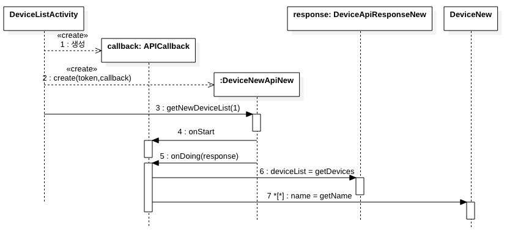

---
[**이전**:3.1 플랫폼 로그인](login.md)

---

### 3.2 디바이스 목록 및 디바이스 상세 조회
- **디바이스 API 동작 개요**

	
	
- **관련 코드**
	- https://github.com/kwanulee/IoTMakerAndroidSDKTest/blob/main/app/src/main/java/com/example/iotmakerandroidsdktest/DeviceListActivity.java#L52-L92
	
#### 3.2.1 디바이스 API  	
---
- **DeviceNewApiNew**
	- IoTMakers의 디바이스에 대해 요청하기 위한 API 클래스
	- **생성자**
		- **public DeviceNewApiNew (String accessToken, APICallback\<DeviceApiResponseNew\> apiCallback)**  
			- **accessToken**: 로그인 시 발급 받은 액세스 토큰
			- **apiCallback**: 디바이스 API 기능을 수행할 때 호출되는 콜백 객체
	- **메소드** 
		- **public void getNewDeviceList (int offset)**
			- 회원의 디바이스 목록을 조회하기 위한 메소드, 파라미터로 요청할 목록의 시작위치를 입력한다.
			- **offset**: 목록의 시작위치 	
			
---
- **APICallback\<T\>**
	- **IoTMakers API** (예, **DeviceNewApiNew**의 디바이스 목록 조회 기능) 실행시 호출되는 콜백 객체의 인터페이스로서, 이 인터페이스 타입의 객체를 **DeviceNewApiNew** 객체 생성 시에 설정해 줘야 한다. 
	- **메소드**
		- **void onStart()**: IoTMakers API(예, **DeviceNewApiNew**의 **getNewDeviceList()**)가 시작될 때 수행할 작업
		- **void onDoing(T t)**: IoTMakers API(예, **DeviceNewApiNew**의 **getNewDeviceList()**)가 정상적인 수행을 마친 후에  T 타입의  응답을 처리하는 작업
		- **void onFail()**: IoTMakers API(예, **DeviceNewApiNew**의 **getNewDeviceList()**)가 정상적인 응답을 수신하지 못할 때 처리할 작업
					
---
- **DeviceApiResponseNew**
	- IoTMakers의 디바이스 요청에 대한 응답 클래스
	- **메소드**
	
		| Method | Description|
		|:----------| :----------|
		| **ArrayList\<DeviceNew\> getDevices ()** | 디바이스 목록을 반환.  목록은 ArrayList에 **DeviceNew** 객체로 반환된다.

---
- **DeviceNew**
	- 디바이스 클래스, 디바이스 목록 조회 시 디바이스에 대한 상세정보를 확인 할 수 있다. 
	- **메소드**
		
		| Method | Description|
		|:----------| :----------|
		|**String getCreatedOn()** |디바이스 생성일시 반환| 
		|**Model getModel()** |디바이스 모델 객체 (이름, 일련번호, 프르토콜 타입 등의 속성 포함) 반환 | 
		|**String getName()** |디바이스 명 반환 | 
		|**String getId()** |디바이스 아이디 반환 | 
		|**String getSequence()** |디바이스 일련번호 반환 | 
		|**String getConnectionId()** |게이트웨이 연결 아이디 반환 | 
		|**Target getTarget()** |서비스 대상 객체(이름, 일련번호, 서비스코드 등의 속성 포함) 반환 | 
		|**List\<TagStrm\> getTagStrmList()** |태그스트림 리스트 반환 | 
		
		
---
[**다음**: 3.3 디바이스 태그스트림 목록, 태그스트림 로그 조회와 제어 명령 보내기](tagstrm.md)
