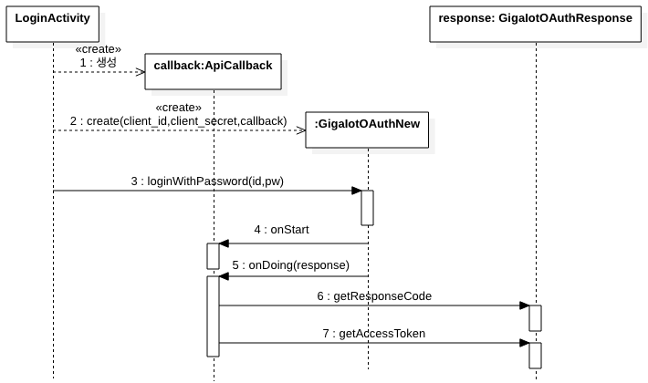

### 3.1 플랫폼 로그인
- 앱을 통해 플랫폼에 로그인을 하는 기능으로서, 플랫폼에 접근할 수 있는 다양한 API를 활용하기 위해서 필수적인 **Access token**을 얻는다.
- 로그인에 필요한 정보는 **IoTMakers** 회원 ID, Password,  애플리케이션 ID와 Secret이고, 애플리케이션 ID와 Secret은 아래와 같이 앱 등록 시 기본정보 메뉴의 **App ID**와 **Secret**에서 확인하시면 됩니다.

	

- **플랫폼 로그인 API 개요**
	
	
- **관련 코드**
	- https://github.com/kwanulee/IoTMakerAndroidSDKTest/blob/main/app/src/main/java/com/example/iotmakerandroidsdktest/LoginActivity.java#L78-L118
	
---
#### 3.1.1 플랫폼 로그인 API 

- **GigaIotOAuthNew**
	- IoTMakers 인증 요청을 위해 사용되는 클래스, Client ID와 Client Secret을 통해 어플리케이션 인증을, 회원 ID와 Password를 통해 회원 인증 요청을 한다 
	- **생성자**
		- **public GigaIotOAuthNew (String clientId, String clientSecret, APICallback\<GiGaIotOAuthResponse\> apiCallback)** 
			- 생성자에 앱 등록 시 발급 받은 앱 ID와 secret를 입력한다. 
			- **clientId**: 앱 등록 시 발급 받은 클라이언트 ID (**App ID**)
			- **clientSecret**: 앱 등록 시 발급 받은 클라이언트 secret (**Secret**)
			- **apiCallback**: 인증 기능을 수행할 때  호출되는 콜백 객체	 
	- **메소드** 
		- **public void loginWithPassword (String id, String password)**
			- 인증 API를 호출하기 위한 메소드, 파라미터로 회원 id와 password를 입력한다. 
			- **id**: 인증 요청 할 회원 id
			- **password**: 인증 요청 할 회원 Password 

---
- **APICallback\<T\>**
	- **IoTMakers API** (예, 로그인 API 기능) 실행시 호출되는 콜백 객체의 인터페이스로서, 이 인터페이스 타입의 객체를 **GigaIotOAuthNew** 객체 생성 시에 설정해 줘야 한다. 
	- **메소드**
		- **void onStart()**: IoTMakers API(예, **GigaIotOAuthNew**의 **loginWithPassword()**)가 시작될 때 수행할 작업
		- **void onDoing(T t)**: IoTMakers API(예, **GigaIotOAuthNew**의 **loginWithPassword()**)가 정상적인 수행을 마친 후에  T 타입의  응답을 처리하는 작업
		- **void onFail()**: IoTMakers API(예, **GigaIotOAuthNew**의 **loginWithPassword()**)가 정상적인 응답을 수신하지 못할 때 처리할 작업
		
---
- **GiGaIotAuthResponse**
	- IoTMakers 인증 요청에 대한 응답결과를 담은 클래스
	- **메소드**
		- **public String getResponseCode ()**: 응답에 대한 코드를 반환
		- **public String getMessage ()**: 응답에 대한 메시지를 반환
		- **public String getAccessToken ()**: 정상적으로 인증이 처리된 경우 발급되며, 이후 모든 API 호출 시 회원 ID와 password없이 액세스 토큰을 사용하여 API를 호출 합니다
		- **public String getMbrSeq ()**: 인증을 요청한 회원에 대한 일련번호

---
[**다음**: 3.2 디바이스 목록 및 디바이스 상세 조회](devices.md)
