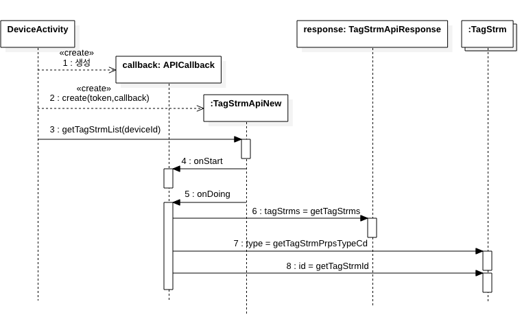
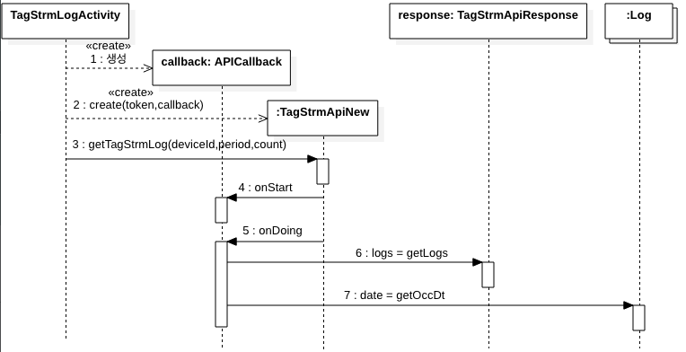
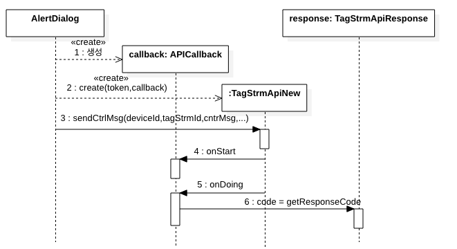

---
[**이전**:3.2 디바이스 목록 및 디바이스 상세 조회](devices.md)

---

### 3.3 디바이스 태그스트림 목록, 태그스트림 로그 조회와 제어 명령 보내기
- **태그스트림 목록 조회 개요**
	
	
	- **코드**: https://github.com/kwanulee/IoTMakerAndroidSDKTest/blob/main/app/src/main/java/com/example/iotmakerandroidsdktest/DeviceActivity.java#L64-L125

- **태그스트림 로그 조회**
	
	
	- **코드**: https://github.com/kwanulee/IoTMakerAndroidSDKTest/blob/main/app/src/main/java/com/example/iotmakerandroidsdktest/TagStrmLogActivity.java#L83-L114

- **제어 명령 보내기**
	
	
	- **코드**: https://github.com/kwanulee/IoTMakerAndroidSDKTest/blob/main/app/src/main/java/com/example/iotmakerandroidsdktest/DeviceActivity.java#L148-L182

#### 3.3.1 태그스트림 API  	
---
- **APICallback\<T\>**
	- 태그스트림 API (예, **TagStrmApiNew**의 태그스트림 목록 조회 기능, 태그스트림 로그 조회 기능,  제어 명령 보내기 기능) 실행시 호출되는 콜백 객체의 인터페이스로서, 이 인터페이스 타입의 객체를 **TagStrmApiNew** 객체 생성 시에 설정해 줘야 한다. 
	- **메소드**
		- **void onStart()**: 태그스트림 API가 시작될 때 수행할 작업
		- **void onDoing(T t)**: 태그스트림 API가 정상적인 수행을 마친 후에  T 타입의 응답을 처리하는 작업
		- **void onFail()**: 태그스트림 API가 정상적인 응답을 수신하지 못할 때 처리할 작업

---
- **TagStrmApiNew**
	- 디바이스의 태그스트림에 대한 수집데이터 이력과 제어 명령을 요청하기 위한 API 클래스
	- **생성자**
		- **public TagStrmApi (String accessToken, APICallback\<DeviceApiResponseNew\> apiCallback)**  
			- **accessToken**: 로그인 시 발급 받은 액세스 토큰
			- **apiCallback**: 태그스트림 API 기능을 수행할 때 호출되는 콜백 객체
	- **메소드**
		- **public void getTagStrmList (String spotDevId)**
			- 디바이스에 등록된 태그스트림 목록을 조회하기 위한 메소드, 파라미터로 디바이스의 아이디를 입력한다. 
			- **spotDevId**: 조회 대상 디바이스의 아이디
		- **public void getTagStrmLog (String spotDevId, String wantPeriod, String count)**
			- 태그스트림의 데이터 이력을 확인하기 위한 메소드, 파라미터로 조회 대상 디바이스의 아이디, 발생 일시 기준 조회 기간(minute), 목록 반환 개수를 입력한다.
			- **spotDevId**: 조회 대상 디바이스의 아이디
			- **wantPeriod**: 발생 일시 기준 조회 기간(minute)
			- **count**: 목록 반환 개수
		- **public void sendCtrlMsg (String svcTgtSeq, String spotDevSeq, String spotDevId, String gwCnctId, String tagStrmId, String tagStrmValTypeCd, String mbrId,String ctrlMsg)** 
			-  디바이스에 등록된 태그스트림에 제어 명령을 요청하는 메소드, 파라미터로 서비스 대상 일련번호, 제어 대상 디바이스 일련번호, 게이트웨이 연결 ID, 태그스트림 ID, 태그스트림 데이터 유형 코드, 회원 ID, 제어 메시지를 입력한다.
			- **svcTgtSeq**: 서비스 대상 일련번호 
			- **spotDevSeq**: 제어 대상 디바이스 일련번호
			- **spotDevId**: 제어 대상 디바이스 ID
			- **gwCnctId**: 게이트웨이 연결 ID
			- **tagStrmId**: 태그스트림 ID
			- **tagStrmValTypeCd**: 태그스트림 데이터 유형 코드
			- **mbrId**: 회원 ID
			- **ctrlMsg**: 제어 메시지
		
---
- **TagStrmApiResponse**
	- IoTMakers의 태그스트림의 수집데이터 이력 조회 및 디바이스에 제어 요청에 대한 응답 클래스
	- **메소드**
	
		| Method | Description|
		|:----------| :----------|
		|public ArrayList<TagStrm> getTagStrms ()|디바이스에 등록된 태그스트림 목록을 가져 올 수 있다. 태그스트림 목록 조회 시 반환되며, ArrayList에 TagStrm 객체로 반환된다|
		|public ArrayList<Log> getLogs ()|디바이스에 등록된 태그스트림에서 발생한 수집데이터 이력을 가져 올 수 있다. 태그스트림 데이터 이력 조회 시 반환되며, ArrayList에 Log 객체로 반환된다.|
		
---
- **TagStrm**
	- 태그스트림 정보 클래스, 디바이스에 등록된 태그스트림 조회 시 태그스트림에 대한 정보를 확인할 수 있다.
	- **속성**
	
		| Attribute | Description|
		|:----------| :----------|
		|String tagStrmSeq|태그스트림일련번호|
		|String tagStrmId|	태그스트림ID|
		|String tagStrmUnitVal|	태그스트림단위값|
		|String tagStrmPrpsTypeCd|	제어코드 0000010:수집 0000020:제어|
		|String tagStrmPrpsTypeCdNm|	
		|String tagStrmValTypeCd|
		|String tagStrmValTypeCdNm| 숫자형여부 0000010:숫자 0000020:문자|
		|String indcOdrg|표시순서|
		|String amdrId|
		|String amdDt|
		
- **Log**
	- 태그스트림 수집데이터 정보 클래스, 디바이스에 등록된 태그스트림 수집 이력 조회 시 수집데이터에 대한 정보를 확인할 수 있다.
	- **속성**
	
		| Attribute | Description|
		|:----------| :----------|
		|String occDt|발생 일시|
		|String spotDevSeq|	현장장치 일련번호|
		|String svcTgtSeq|	서비스대상 일련번호|
		|HashMap\<String, Object\> attributes|수집 데이터 HashMap|
		

